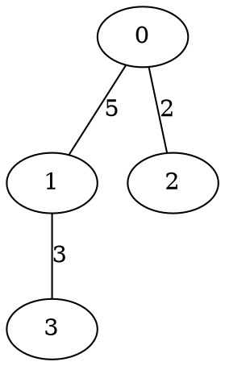

# T04 — Representación de grafos en Rust

## Objetivo

Dominar las formas idiomáticas de representar grafos en Rust:
`Vec<Vec<usize>>` para grafos simples, `HashMap` para vértices dispersos o
con etiquetas, y el crate `petgraph` para aplicaciones en producción.
Comprender los trade-offs de ownership, borrowing y genericidad que Rust
impone al diseño de grafos.

---

## 1. El desafío de los grafos en Rust

Los grafos son una de las estructuras más difíciles de modelar en Rust
porque violan los principios fundamentales del ownership:

- Un vértice puede ser "apuntado" por múltiples aristas → **múltiples
  owners** o referencias compartidas.
- Recorrer un grafo requiere acceder a vértices a través de caminos
  arbitrarios → **borrowing complejo**.
- Modificar el grafo mientras se recorre es un patrón común en algoritmos
  → **conflicto entre `&` y `&mut`**.

La solución idiomática en Rust es **no usar punteros/referencias entre
nodos**, sino **indexar con enteros**. Los vértices se identifican por
`usize` y los datos se almacenan en `Vec`s paralelos. Esto elimina todos
los problemas de lifetime y borrowing a cambio de perder la verificación
estática de que un índice es válido.

---

## 2. `Vec<Vec<usize>>` — la representación mínima

La forma más simple y la más usada en competencias y algoritmos:

```rust
// Unweighted, undirected
let n = 5;
let mut adj: Vec<Vec<usize>> = vec![vec![]; n];

// Add edge 0-1
adj[0].push(1);
adj[1].push(0);

// Iterate neighbors of vertex 2
for &v in &adj[2] {
    println!("neighbor: {v}");
}
```

### Con pesos

```rust
// Weighted edges: Vec<Vec<(usize, i64)>>
let mut adj: Vec<Vec<(usize, i64)>> = vec![vec![]; n];

adj[0].push((1, 5));  // edge 0→1, weight 5
adj[1].push((0, 5));  // undirected: also 1→0
```

### Ventajas

- **Zero overhead**: no structs, no traits, no indirección.
- **Cache-friendly**: cada lista de vecinos es un `Vec` contiguo.
- **Trivial de pasar a funciones**: `&[Vec<usize>]` o `&mut [Vec<usize>]`.
- **Familiar**: cualquier programador de C/C++/Python reconoce el patrón.

### Limitaciones

- Los vértices son `0..n` — no soporta etiquetas arbitrarias sin mapeo
  externo.
- No hay validación de que un índice es válido (panic en runtime si se
  accede fuera de rango).
- No distingue entre dirigido y no dirigido — el usuario debe ser
  consistente.
- Eliminar vértices es costoso (requiere re-indexar o dejar huecos).

---

## 3. Struct wrapper para más seguridad

Envolver `Vec<Vec<...>>` en un struct añade API clara y evita errores:

```rust
struct Graph {
    adj: Vec<Vec<(usize, i64)>>,
    directed: bool,
}

impl Graph {
    fn new(n: usize, directed: bool) -> Self {
        Graph {
            adj: vec![vec![]; n],
            directed,
        }
    }

    fn add_edge(&mut self, u: usize, v: usize, weight: i64) {
        self.adj[u].push((v, weight));
        if !self.directed {
            self.adj[v].push((u, weight));
        }
    }

    fn neighbors(&self, u: usize) -> &[(usize, i64)] {
        &self.adj[u]
    }

    fn n(&self) -> usize {
        self.adj.len()
    }

    fn has_edge(&self, u: usize, v: usize) -> bool {
        self.adj[u].iter().any(|&(dest, _)| dest == v)
    }

    fn degree(&self, u: usize) -> usize {
        self.adj[u].len()
    }
}
```

### Genericidad con tipo de peso

Para soportar diferentes tipos de peso (`i32`, `f64`, unweighted):

```rust
struct Graph<W: Copy> {
    adj: Vec<Vec<(usize, W)>>,
    directed: bool,
}

impl<W: Copy> Graph<W> {
    fn new(n: usize, directed: bool) -> Self {
        Graph {
            adj: vec![vec![]; n],
            directed,
        }
    }

    fn add_edge(&mut self, u: usize, v: usize, weight: W) {
        self.adj[u].push((v, weight));
        if !self.directed {
            self.adj[v].push((u, weight));
        }
    }

    fn neighbors(&self, u: usize) -> &[(usize, W)] {
        &self.adj[u]
    }
}

// Unweighted: use () as weight
type UnweightedGraph = Graph<()>;

impl UnweightedGraph {
    fn add_unweighted_edge(&mut self, u: usize, v: usize) {
        self.add_edge(u, v, ());
    }
}
```

Usar `()` como peso tiene costo cero: `(usize, ())` tiene el mismo tamaño
que `usize` gracias a la optimización de ZST (*zero-sized type*).

---

## 4. `HashMap` para vértices no numéricos

Cuando los vértices son strings, identificadores arbitrarios, o el rango de
IDs es muy disperso (ej. IDs de usuario `[1001, 5042, 99999]`), un `HashMap`
es más natural:

```rust
use std::collections::HashMap;

// Vertices are strings, edges are weighted
let mut adj: HashMap<String, Vec<(String, f64)>> = HashMap::new();

adj.entry("Lima".into()).or_default().push(("Cusco".into(), 1100.0));
adj.entry("Cusco".into()).or_default().push(("Lima".into(), 1100.0));
adj.entry("Lima".into()).or_default().push(("Arequipa".into(), 1000.0));
adj.entry("Arequipa".into()).or_default().push(("Lima".into(), 1000.0));

// Iterate neighbors
if let Some(neighbors) = adj.get("Lima") {
    for (city, dist) in neighbors {
        println!("Lima → {city}: {dist} km");
    }
}
```

### Versión genérica

```rust
use std::collections::HashMap;
use std::hash::Hash;

struct HashGraph<V: Eq + Hash + Clone, W: Copy> {
    adj: HashMap<V, Vec<(V, W)>>,
    directed: bool,
}

impl<V: Eq + Hash + Clone, W: Copy> HashGraph<V, W> {
    fn new(directed: bool) -> Self {
        HashGraph {
            adj: HashMap::new(),
            directed,
        }
    }

    fn add_vertex(&mut self, v: V) {
        self.adj.entry(v).or_default();
    }

    fn add_edge(&mut self, u: V, v: V, weight: W) {
        self.adj.entry(u.clone()).or_default().push((v.clone(), weight));
        if !self.directed {
            self.adj.entry(v).or_default().push((u, weight));
        }
    }

    fn neighbors(&self, v: &V) -> &[(V, W)] {
        self.adj.get(v).map(|n| n.as_slice()).unwrap_or(&[])
    }

    fn vertices(&self) -> impl Iterator<Item = &V> {
        self.adj.keys()
    }
}
```

### Trade-offs vs `Vec<Vec<>>`

| Aspecto | `Vec<Vec<>>` | `HashMap<V, Vec<>>` |
|---------|:------------:|:-------------------:|
| Acceso a vecinos | $O(1)$ indexación | $O(1)$ amortizado (hash) |
| Tipo de vértice | `usize` solamente | Cualquier `Eq + Hash` |
| Agregar vértice | Solo al final (`push`) | $O(1)$ cualquier ID |
| Eliminar vértice | Costoso (re-indexar) | $O(\deg)$ |
| Iteración ordenada | Sí (0..n) | No (orden arbitrario) |
| Memoria overhead | Mínimo | ~50-70 bytes por vértice extra |
| Mejor para | Algoritmos, competencias | APIs, grafos dinámicos |

---

## 5. Datos en los vértices

Los algoritmos frecuentemente necesitan almacenar datos **en** los vértices
(distancia, color, padre, etc.). En Rust hay dos patrones:

### Patrón 1: Arrays paralelos (preferido)

```rust
let n = graph.n();
let mut dist = vec![i64::MAX; n];
let mut visited = vec![false; n];
let mut parent = vec![None::<usize>; n];

dist[source] = 0;
// ... BFS/Dijkstra modifica dist, visited, parent ...
```

Ventaja: los datos del algoritmo están separados del grafo → el grafo puede
ser `&` (inmutable) mientras se modifican los arrays. Esto resuelve el
conflicto de borrowing de forma natural.

### Patrón 2: Struct con datos del nodo

```rust
#[derive(Clone)]
struct NodeData {
    label: String,
    x: f64,
    y: f64,
}

struct LabeledGraph {
    adj: Vec<Vec<(usize, i64)>>,
    nodes: Vec<NodeData>,
}

impl LabeledGraph {
    fn add_vertex(&mut self, data: NodeData) -> usize {
        let id = self.nodes.len();
        self.nodes.push(data);
        self.adj.push(vec![]);
        id
    }
}
```

El `id` retornado es el índice en ambos `Vec`s. Los datos del nodo y la
topología del grafo están sincronizados por índice.

### Patrón 3: HashMap bidireccional para etiquetas

Cuando se necesita buscar vértices por nombre y también iterar por índice:

```rust
use std::collections::HashMap;

struct NamedGraph {
    adj: Vec<Vec<(usize, i64)>>,
    name_to_id: HashMap<String, usize>,
    id_to_name: Vec<String>,
}

impl NamedGraph {
    fn new() -> Self {
        NamedGraph {
            adj: vec![],
            name_to_id: HashMap::new(),
            id_to_name: vec![],
        }
    }

    fn add_vertex(&mut self, name: &str) -> usize {
        if let Some(&id) = self.name_to_id.get(name) {
            return id;
        }
        let id = self.id_to_name.len();
        self.name_to_id.insert(name.to_string(), id);
        self.id_to_name.push(name.to_string());
        self.adj.push(vec![]);
        id
    }

    fn add_edge_by_name(&mut self, u: &str, v: &str, weight: i64) {
        let uid = self.add_vertex(u);
        let vid = self.add_vertex(v);
        self.adj[uid].push((vid, weight));
        self.adj[vid].push((uid, weight));
    }

    fn id(&self, name: &str) -> Option<usize> {
        self.name_to_id.get(name).copied()
    }

    fn name(&self, id: usize) -> &str {
        &self.id_to_name[id]
    }
}
```

Este es el patrón más práctico para grafos del mundo real donde los vértices
tienen nombres significativos pero los algoritmos necesitan índices numéricos
para arrays paralelos.

---

## 6. El crate `petgraph`

[`petgraph`](https://docs.rs/petgraph) es la biblioteca de grafos más usada
en el ecosistema Rust. Proporciona múltiples representaciones, algoritmos
estándar y una API segura y genérica.

### Dependencia

```toml
# Cargo.toml
[dependencies]
petgraph = "0.7"
```

### Tipos principales

| Tipo | Descripción |
|------|------------|
| `Graph<N, E, Ty>` | Lista de adyacencia (CSR-like). `Ty` = `Directed` o `Undirected` |
| `StableGraph<N, E, Ty>` | Como `Graph` pero los índices son estables al eliminar nodos |
| `GraphMap<N, E, Ty>` | Basado en HashMap, nodos son los valores mismos |
| `MatrixGraph<N, E, Ty>` | Matriz de adyacencia densa |
| `Csr<N, E, Ty>` | Compressed Sparse Row (inmutable, muy compacto) |

`N` = tipo de dato del nodo, `E` = tipo de dato de la arista, `Ty` =
dirección.

### Uso básico con `Graph`

```rust
use petgraph::graph::{Graph, NodeIndex};
use petgraph::Undirected;

let mut g: Graph<&str, f64, Undirected> = Graph::new_undirected();

// Add nodes — returns NodeIndex
let a = g.add_node("Lima");
let b = g.add_node("Cusco");
let c = g.add_node("Arequipa");

// Add edges — returns EdgeIndex
g.add_edge(a, b, 1100.0);
g.add_edge(a, c, 1000.0);
g.add_edge(b, c, 500.0);

// Access node data
println!("Node a: {}", g[a]);  // "Lima"

// Iterate neighbors
for neighbor in g.neighbors(a) {
    println!("{} → {}", g[a], g[neighbor]);
}

// Iterate edges with weights
for edge in g.edges(a) {
    println!("{} → {}: {} km", g[a], g[edge.target()], edge.weight());
}
```

### `NodeIndex` vs `usize`

`petgraph` usa **newtypes** (`NodeIndex`, `EdgeIndex`) en lugar de `usize`
raw. Esto previene errores como confundir un índice de nodo con un índice
de arista o un entero cualquiera:

```rust
let a: NodeIndex = g.add_node("A");
// let x: usize = a;  // ERROR: NodeIndex is not usize
let x: usize = a.index();  // explicit conversion
```

### Algoritmos integrados

`petgraph` incluye implementaciones listas para usar:

```rust
use petgraph::algo::{dijkstra, bellman_ford, min_spanning_tree,
                     connected_components, is_cyclic_directed,
                     toposort, kosaraju_scc};
use petgraph::dot::Dot;

// Dijkstra from node a
let distances = dijkstra(&g, a, None, |e| *e.weight());
// distances: HashMap<NodeIndex, f64>

// Connected components
let n_components = connected_components(&g);

// Topological sort (directed graph)
// let order = toposort(&directed_g, None);

// Export to Graphviz DOT format
println!("{:?}", Dot::new(&g));
```

### `GraphMap` — nodos como valores

Cuando los nodos son tipos simples (`&str`, `i32`, etc.) y no se quiere
manejar `NodeIndex`:

```rust
use petgraph::graphmap::UnGraphMap;

let mut g = UnGraphMap::<&str, f64>::new();
g.add_edge("Lima", "Cusco", 1100.0);
g.add_edge("Lima", "Arequipa", 1000.0);

// Direct access by node value
for (neighbor, &weight) in g.edges("Lima") {
    println!("Lima → {neighbor}: {weight} km");
}

// Check edge
assert!(g.contains_edge("Lima", "Cusco"));
```

`GraphMap` usa internamente un `BTreeMap`, así que los nodos deben
implementar `Ord`.

---

## 7. Comparación de representaciones en Rust

| Criterio | `Vec<Vec<>>` | `HashMap<V,Vec<>>` | `petgraph::Graph` | `petgraph::GraphMap` |
|----------|:------------:|:-------------------:|:-----------------:|:--------------------:|
| Setup | Ninguno | Ninguno | Crate externo | Crate externo |
| Tipo vértice | `usize` | Cualquier `Hash+Eq` | `NodeIndex` (newtype) | Cualquier `Ord+Copy` |
| Agregar vértice | $O(1)$ | $O(1)$ | $O(1)$ | $O(\log n)$ |
| Agregar arista | $O(1)$ | $O(1)$ | $O(1)$ | $O(\log n)$ |
| Vecinos | $O(\deg)$ | $O(\deg)$ | $O(\deg)$ | $O(\deg)$ |
| ¿Existe arista? | $O(\deg)$ | $O(\deg)$ | $O(\deg)$ | $O(\log n)$ |
| Eliminar nodo | Difícil | $O(\deg + m)$ | $O(n + m)$ | $O(n)$ |
| Algoritmos incluidos | No | No | Sí (Dijkstra, BFS...) | Sí |
| Mejor para | Competencias | APIs con claves ricas | Producción | Prototipos rápidos |

---

## 8. Patrones idiomáticos

### BFS genérico

```rust
use std::collections::VecDeque;

fn bfs(adj: &[Vec<usize>], source: usize) -> Vec<i32> {
    let n = adj.len();
    let mut dist = vec![-1i32; n];
    let mut queue = VecDeque::new();

    dist[source] = 0;
    queue.push_back(source);

    while let Some(u) = queue.pop_front() {
        for &v in &adj[u] {
            if dist[v] == -1 {
                dist[v] = dist[u] + 1;
                queue.push_back(v);
            }
        }
    }
    dist
}
```

La firma `&[Vec<usize>]` acepta tanto `&Vec<Vec<usize>>` como un slice,
maximizando la flexibilidad.

### DFS con closure

```rust
fn dfs_with<F>(adj: &[Vec<usize>], source: usize, mut visit: F)
where
    F: FnMut(usize, usize),  // (vertex, depth)
{
    let n = adj.len();
    let mut visited = vec![false; n];
    let mut stack = vec![(source, 0usize)];

    while let Some((u, depth)) = stack.pop() {
        if visited[u] {
            continue;
        }
        visited[u] = true;
        visit(u, depth);

        for &v in adj[u].iter().rev() {
            if !visited[v] {
                stack.push((v, depth + 1));
            }
        }
    }
}

// Usage
dfs_with(&adj, 0, |v, d| {
    println!("vertex {v} at depth {d}");
});
```

### Builder pattern para construcción

```rust
struct GraphBuilder {
    n: usize,
    edges: Vec<(usize, usize, i64)>,
    directed: bool,
}

impl GraphBuilder {
    fn new(n: usize) -> Self {
        GraphBuilder { n, edges: vec![], directed: false }
    }

    fn directed(mut self) -> Self {
        self.directed = true;
        self
    }

    fn edge(mut self, u: usize, v: usize, w: i64) -> Self {
        self.edges.push((u, v, w));
        self
    }

    fn build(self) -> Vec<Vec<(usize, i64)>> {
        let mut adj = vec![vec![]; self.n];
        for (u, v, w) in self.edges {
            adj[u].push((v, w));
            if !self.directed {
                adj[v].push((u, w));
            }
        }
        adj
    }
}

// Usage
let adj = GraphBuilder::new(5)
    .edge(0, 1, 5)
    .edge(1, 2, 3)
    .edge(2, 3, 7)
    .build();
```

### Leer grafo desde stdin

```rust
use std::io::{self, BufRead};

fn read_graph() -> (usize, Vec<Vec<(usize, i64)>>) {
    let stdin = io::stdin();
    let mut lines = stdin.lock().lines();

    let first_line = lines.next().unwrap().unwrap();
    let mut parts = first_line.split_whitespace();
    let n: usize = parts.next().unwrap().parse().unwrap();
    let m: usize = parts.next().unwrap().parse().unwrap();

    let mut adj = vec![vec![]; n];
    for _ in 0..m {
        let line = lines.next().unwrap().unwrap();
        let mut parts = line.split_whitespace();
        let u: usize = parts.next().unwrap().parse().unwrap();
        let v: usize = parts.next().unwrap().parse().unwrap();
        let w: i64 = parts.next().unwrap().parse().unwrap();
        adj[u].push((v, w));
        adj[v].push((u, w));
    }
    (n, adj)
}
```

---

## 9. Por qué no `Rc<RefCell<Node>>` para grafos

Es tentador modelar grafos como en otros lenguajes:

```rust
use std::rc::Rc;
use std::cell::RefCell;

struct Node {
    value: String,
    neighbors: Vec<Rc<RefCell<Node>>>,
}
```

Esto funciona pero tiene problemas serios:

1. **Memory leaks**: ciclos de `Rc` nunca se liberan (reference count nunca
   llega a 0). Se necesita `Weak` para romper ciclos, complicando el código.
2. **Runtime cost**: cada acceso a un vecino pasa por `RefCell::borrow()`,
   que verifica borrowing en runtime — panic si ya hay un `borrow_mut`.
3. **Cache-hostile**: cada nodo es un objeto separado en el heap, disperso.
4. **API incómoda**: `Rc::clone()`, `.borrow()`, `.borrow_mut()` en todos
   lados.

La representación con índices (`Vec<Vec<usize>>`) no tiene ninguno de estos
problemas. La regla práctica en Rust es: **si puedes usar índices enteros en
lugar de punteros/referencias, úsalos**.

---

## 10. Programa completo en C

```c
/*
 * graph_repr_patterns.c
 *
 * Demonstrates the C equivalents of Rust graph representation
 * patterns: struct-based, named vertices, and generic approach.
 *
 * Compile: gcc -O2 -o graph_repr_patterns graph_repr_patterns.c
 * Run:     ./graph_repr_patterns
 */

#include <stdio.h>
#include <stdlib.h>
#include <stdbool.h>
#include <string.h>

#define MAX_NAME 32

/* ================ BASIC: array of dynamic arrays ================== */

typedef struct {
    int *dests;
    int *weights;
    int size;
    int cap;
} NbrList;

typedef struct {
    NbrList *adj;
    int n;
    bool directed;
} BasicGraph;

static void nl_init(NbrList *nl) {
    nl->dests = NULL; nl->weights = NULL;
    nl->size = 0; nl->cap = 0;
}

static void nl_push(NbrList *nl, int dest, int w) {
    if (nl->size == nl->cap) {
        nl->cap = nl->cap ? nl->cap * 2 : 4;
        nl->dests = realloc(nl->dests, nl->cap * sizeof(int));
        nl->weights = realloc(nl->weights, nl->cap * sizeof(int));
    }
    nl->dests[nl->size] = dest;
    nl->weights[nl->size] = w;
    nl->size++;
}

static void nl_free(NbrList *nl) {
    free(nl->dests); free(nl->weights);
}

BasicGraph bg_create(int n, bool directed) {
    BasicGraph g;
    g.n = n; g.directed = directed;
    g.adj = malloc(n * sizeof(NbrList));
    for (int i = 0; i < n; i++) nl_init(&g.adj[i]);
    return g;
}

void bg_free(BasicGraph *g) {
    for (int i = 0; i < g->n; i++) nl_free(&g->adj[i]);
    free(g->adj);
}

void bg_add_edge(BasicGraph *g, int u, int v, int w) {
    nl_push(&g->adj[u], v, w);
    if (!g->directed) nl_push(&g->adj[v], u, w);
}

/* ================== NAMED: with string labels ===================== */

typedef struct {
    BasicGraph graph;
    char (*names)[MAX_NAME];   /* array of name strings */
    int name_count;
} NamedGraph;

NamedGraph ng_create(int max_vertices, bool directed) {
    NamedGraph ng;
    ng.graph = bg_create(max_vertices, directed);
    ng.graph.n = 0;  /* will grow as vertices are added */
    ng.names = malloc(max_vertices * sizeof(*ng.names));
    ng.name_count = 0;
    return ng;
}

void ng_free(NamedGraph *ng) {
    bg_free(&ng->graph);
    free(ng->names);
}

int ng_add_vertex(NamedGraph *ng, const char *name) {
    /* Check if already exists */
    for (int i = 0; i < ng->name_count; i++) {
        if (strcmp(ng->names[i], name) == 0)
            return i;
    }
    int id = ng->name_count++;
    strncpy(ng->names[id], name, MAX_NAME - 1);
    ng->names[id][MAX_NAME - 1] = '\0';
    ng->graph.n = ng->name_count;
    return id;
}

void ng_add_edge(NamedGraph *ng, const char *u, const char *v, int w) {
    int uid = ng_add_vertex(ng, u);
    int vid = ng_add_vertex(ng, v);
    bg_add_edge(&ng->graph, uid, vid, w);
}

const char *ng_name(const NamedGraph *ng, int id) {
    return ng->names[id];
}

/* ============================ DEMOS =============================== */

/*
 * Demo 1: Basic Vec<Vec<>> equivalent
 */
void demo_basic(void) {
    printf("=== Demo 1: Basic Graph (array of arrays) ===\n\n");

    BasicGraph g = bg_create(5, false);
    bg_add_edge(&g, 0, 1, 5);
    bg_add_edge(&g, 0, 2, 2);
    bg_add_edge(&g, 1, 3, 3);
    bg_add_edge(&g, 2, 3, 7);
    bg_add_edge(&g, 3, 4, 1);

    for (int i = 0; i < g.n; i++) {
        printf("  %d →", i);
        for (int j = 0; j < g.adj[i].size; j++)
            printf(" %d(%d)", g.adj[i].dests[j], g.adj[i].weights[j]);
        printf("\n");
    }

    printf("\n  Vertex 1 has %d neighbors\n", g.adj[1].size);
    printf("  Edge 0→1 weight: %d\n\n", g.adj[0].weights[0]);

    bg_free(&g);
}

/*
 * Demo 2: Named graph (HashMap equivalent)
 */
void demo_named(void) {
    printf("=== Demo 2: Named Graph (string vertices) ===\n\n");

    NamedGraph ng = ng_create(10, false);
    ng_add_edge(&ng, "Lima", "Cusco", 1100);
    ng_add_edge(&ng, "Lima", "Arequipa", 1000);
    ng_add_edge(&ng, "Cusco", "Arequipa", 500);
    ng_add_edge(&ng, "Lima", "Trujillo", 560);

    printf("  City graph (%d vertices):\n", ng.name_count);
    for (int i = 0; i < ng.name_count; i++) {
        printf("  %s →", ng_name(&ng, i));
        for (int j = 0; j < ng.graph.adj[i].size; j++) {
            int dest = ng.graph.adj[i].dests[j];
            int w = ng.graph.adj[i].weights[j];
            printf(" %s(%d km)", ng_name(&ng, dest), w);
        }
        printf("\n");
    }

    /* Find vertex by name */
    printf("\n  Looking up 'Cusco'...\n");
    int cusco_id = ng_add_vertex(&ng, "Cusco");  /* returns existing id */
    printf("  Found at id=%d, neighbors: %d\n\n",
           cusco_id, ng.graph.adj[cusco_id].size);

    ng_free(&ng);
}

/*
 * Demo 3: BFS with parallel arrays (Rust pattern)
 */
void demo_bfs(void) {
    printf("=== Demo 3: BFS with Parallel Arrays ===\n\n");

    BasicGraph g = bg_create(7, false);
    bg_add_edge(&g, 0, 1, 1);
    bg_add_edge(&g, 0, 2, 1);
    bg_add_edge(&g, 1, 3, 1);
    bg_add_edge(&g, 1, 4, 1);
    bg_add_edge(&g, 2, 5, 1);
    bg_add_edge(&g, 4, 6, 1);
    bg_add_edge(&g, 5, 6, 1);

    /* Parallel arrays — separate from graph structure */
    int *dist = malloc(g.n * sizeof(int));
    int *parent = malloc(g.n * sizeof(int));
    for (int i = 0; i < g.n; i++) { dist[i] = -1; parent[i] = -1; }

    int queue[7], front = 0, back = 0;
    dist[0] = 0;
    queue[back++] = 0;

    while (front < back) {
        int u = queue[front++];
        for (int j = 0; j < g.adj[u].size; j++) {
            int v = g.adj[u].dests[j];
            if (dist[v] == -1) {
                dist[v] = dist[u] + 1;
                parent[v] = u;
                queue[back++] = v;
            }
        }
    }

    printf("  Distances from vertex 0:\n");
    for (int i = 0; i < g.n; i++)
        printf("    %d: dist=%d, parent=%d\n", i, dist[i], parent[i]);

    /* Reconstruct path to vertex 6 */
    printf("\n  Path 0 → 6: ");
    int path[7], plen = 0;
    for (int v = 6; v != -1; v = parent[v])
        path[plen++] = v;
    for (int i = plen - 1; i >= 0; i--)
        printf("%d%s", path[i], i > 0 ? " → " : "\n\n");

    free(dist);
    free(parent);
    bg_free(&g);
}

/*
 * Demo 4: Directed graph with in-degree array
 */
void demo_in_degree(void) {
    printf("=== Demo 4: Directed with In-Degree Array ===\n\n");

    BasicGraph g = bg_create(6, true);
    bg_add_edge(&g, 5, 0, 1);
    bg_add_edge(&g, 5, 2, 1);
    bg_add_edge(&g, 4, 0, 1);
    bg_add_edge(&g, 4, 1, 1);
    bg_add_edge(&g, 2, 3, 1);
    bg_add_edge(&g, 3, 1, 1);

    /* Compute in-degrees (parallel array) */
    int *in_deg = calloc(g.n, sizeof(int));
    for (int u = 0; u < g.n; u++)
        for (int j = 0; j < g.adj[u].size; j++)
            in_deg[g.adj[u].dests[j]]++;

    printf("  DAG (task dependencies):\n");
    for (int i = 0; i < g.n; i++) {
        printf("    %d: out=%d, in=%d", i, g.adj[i].size, in_deg[i]);
        if (in_deg[i] == 0) printf(" ← source (no dependencies)");
        if (g.adj[i].size == 0) printf(" ← sink (nothing depends on it)");
        printf("\n");
    }

    /* Topological order via Kahn's algorithm (preview) */
    printf("\n  Kahn's topological sort: ");
    int *temp_in = malloc(g.n * sizeof(int));
    memcpy(temp_in, in_deg, g.n * sizeof(int));
    int queue[6], front = 0, back = 0;

    for (int i = 0; i < g.n; i++)
        if (temp_in[i] == 0) queue[back++] = i;

    while (front < back) {
        int u = queue[front++];
        printf("%d ", u);
        for (int j = 0; j < g.adj[u].size; j++) {
            int v = g.adj[u].dests[j];
            if (--temp_in[v] == 0)
                queue[back++] = v;
        }
    }
    printf("\n\n");

    free(in_deg);
    free(temp_in);
    bg_free(&g);
}

/*
 * Demo 5: Graph from "file" (string input)
 */
void demo_from_input(void) {
    printf("=== Demo 5: Graph from Input String ===\n\n");

    const char *input =
        "4 5\n"
        "0 1 10\n"
        "0 2 20\n"
        "1 2 30\n"
        "1 3 40\n"
        "2 3 50\n";

    printf("  Input:\n  %s\n", input);

    int n, m;
    const char *ptr = input;
    sscanf(ptr, "%d %d", &n, &m);
    ptr = strchr(ptr, '\n') + 1;

    BasicGraph g = bg_create(n, false);
    for (int i = 0; i < m; i++) {
        int u, v, w;
        sscanf(ptr, "%d %d %d", &u, &v, &w);
        bg_add_edge(&g, u, v, w);
        ptr = strchr(ptr, '\n');
        if (ptr) ptr++;
    }

    printf("  Parsed graph (%d vertices, %d edges):\n", n, m);
    for (int i = 0; i < g.n; i++) {
        printf("    %d →", i);
        for (int j = 0; j < g.adj[i].size; j++)
            printf(" %d(%d)", g.adj[i].dests[j], g.adj[i].weights[j]);
        printf("\n");
    }
    printf("\n");

    bg_free(&g);
}

/*
 * Demo 6: Memory layout comparison
 */
void demo_memory_layout(void) {
    printf("=== Demo 6: Memory Layout Comparison ===\n\n");

    printf("  Sizes of key types:\n");
    printf("    NbrList struct:  %zu bytes\n", sizeof(NbrList));
    printf("    Per neighbor:    %zu bytes (dest + weight)\n", 2 * sizeof(int));
    printf("    BasicGraph:      %zu bytes (header)\n", sizeof(BasicGraph));

    int n_cases[] = {100, 1000, 10000};
    int m_cases[] = {300, 5000, 30000};

    printf("\n  %-8s %-8s %-18s %-18s\n", "n", "m", "Vec<Vec> (bytes)", "Matrix (bytes)");
    for (int c = 0; c < 3; c++) {
        int n = n_cases[c], m = m_cases[c];
        /* Vec<Vec>: n NbrList structs + 2m * 2 * sizeof(int) */
        long vec_bytes = (long)n * sizeof(NbrList) + 2L * m * 2 * sizeof(int);
        /* Matrix: n*n ints */
        long mat_bytes = (long)n * n * sizeof(int);
        printf("  %-8d %-8d %-18ld %-18ld (%.0fx)\n",
               n, m, vec_bytes, mat_bytes,
               (double)mat_bytes / vec_bytes);
    }
    printf("\n");
}

/* ================================================================== */

int main(void) {
    printf("╔══════════════════════════════════════════════════════╗\n");
    printf("║  Graph Representation Patterns — C Demonstrations   ║\n");
    printf("╚══════════════════════════════════════════════════════╝\n\n");

    demo_basic();
    demo_named();
    demo_bfs();
    demo_in_degree();
    demo_from_input();
    demo_memory_layout();

    printf("╔══════════════════════════════════════════════════════╗\n");
    printf("║  All representation patterns demonstrated!          ║\n");
    printf("╚══════════════════════════════════════════════════════╝\n");

    return 0;
}
```

---

## 11. Programa completo en Rust

```rust
/*
 * graph_repr_rust.rs
 *
 * Demonstrates idiomatic Rust graph representations:
 * Vec<Vec<>>, HashMap, struct wrappers, named graphs, and petgraph.
 *
 * Run: cargo run --release
 *
 * Cargo.toml:
 * [dependencies]
 * petgraph = "0.7"
 */

use std::collections::{HashMap, VecDeque};

// ── Graph struct wrapper ─────────────────────────────────────────────

struct Graph<W: Copy> {
    adj: Vec<Vec<(usize, W)>>,
    directed: bool,
}

impl<W: Copy> Graph<W> {
    fn new(n: usize, directed: bool) -> Self {
        Graph {
            adj: vec![vec![]; n],
            directed,
        }
    }

    fn add_edge(&mut self, u: usize, v: usize, w: W) {
        self.adj[u].push((v, w));
        if !self.directed {
            self.adj[v].push((u, w));
        }
    }

    fn n(&self) -> usize {
        self.adj.len()
    }

    fn neighbors(&self, u: usize) -> &[(usize, W)] {
        &self.adj[u]
    }
}

// ── Named graph ──────────────────────────────────────────────────────

struct NamedGraph<W: Copy> {
    adj: Vec<Vec<(usize, W)>>,
    name_to_id: HashMap<String, usize>,
    id_to_name: Vec<String>,
    directed: bool,
}

impl<W: Copy> NamedGraph<W> {
    fn new(directed: bool) -> Self {
        NamedGraph {
            adj: vec![],
            name_to_id: HashMap::new(),
            id_to_name: vec![],
            directed,
        }
    }

    fn add_vertex(&mut self, name: &str) -> usize {
        if let Some(&id) = self.name_to_id.get(name) {
            return id;
        }
        let id = self.id_to_name.len();
        self.name_to_id.insert(name.to_string(), id);
        self.id_to_name.push(name.to_string());
        self.adj.push(vec![]);
        id
    }

    fn add_edge(&mut self, u: &str, v: &str, weight: W) {
        let uid = self.add_vertex(u);
        let vid = self.add_vertex(v);
        self.adj[uid].push((vid, weight));
        if !self.directed {
            self.adj[vid].push((uid, weight));
        }
    }

    fn name(&self, id: usize) -> &str {
        &self.id_to_name[id]
    }

    fn n(&self) -> usize {
        self.id_to_name.len()
    }
}

// ── Demo 1: Vec<Vec<usize>> — the minimal approach ──────────────────

fn demo_vec_vec() {
    println!("=== Demo 1: Vec<Vec<usize>> — Minimal ===\n");

    let n = 5;
    let mut adj: Vec<Vec<usize>> = vec![vec![]; n];

    // Add undirected edges
    let edges = [(0, 1), (0, 2), (1, 3), (1, 4), (2, 4), (3, 4)];
    for &(u, v) in &edges {
        adj[u].push(v);
        adj[v].push(u);
    }

    println!("Adjacency list (unweighted, undirected):");
    for (i, neighbors) in adj.iter().enumerate() {
        println!("  {i} → {neighbors:?}");
    }

    // BFS
    let dist = bfs(&adj, 0);
    println!("\nBFS distances from 0: {dist:?}");

    // DFS
    print!("DFS order from 0: ");
    dfs_with(&adj, 0, |v, d| print!("{v}(d={d}) "));
    println!("\n");
}

fn bfs(adj: &[Vec<usize>], source: usize) -> Vec<i32> {
    let n = adj.len();
    let mut dist = vec![-1i32; n];
    let mut queue = VecDeque::new();
    dist[source] = 0;
    queue.push_back(source);
    while let Some(u) = queue.pop_front() {
        for &v in &adj[u] {
            if dist[v] == -1 {
                dist[v] = dist[u] + 1;
                queue.push_back(v);
            }
        }
    }
    dist
}

fn dfs_with<F>(adj: &[Vec<usize>], source: usize, mut visit: F)
where
    F: FnMut(usize, usize),
{
    let n = adj.len();
    let mut visited = vec![false; n];
    let mut stack = vec![(source, 0usize)];
    while let Some((u, depth)) = stack.pop() {
        if visited[u] {
            continue;
        }
        visited[u] = true;
        visit(u, depth);
        for &v in adj[u].iter().rev() {
            if !visited[v] {
                stack.push((v, depth + 1));
            }
        }
    }
}

// ── Demo 2: Weighted graph struct ────────────────────────────────────

fn demo_struct_wrapper() {
    println!("=== Demo 2: Graph<W> Struct Wrapper ===\n");

    let mut g = Graph::new(5, false);
    g.add_edge(0, 1, 5i64);
    g.add_edge(0, 2, 2);
    g.add_edge(1, 3, 3);
    g.add_edge(2, 3, 7);
    g.add_edge(3, 4, 1);

    println!("Weighted graph (n={}):", g.n());
    for i in 0..g.n() {
        let nbrs: Vec<String> = g.neighbors(i)
            .iter()
            .map(|&(d, w)| format!("{d}(w={w})"))
            .collect();
        println!("  {i} → [{}]", nbrs.join(", "));
    }

    // Demonstrate parallel arrays pattern
    let mut dist = vec![i64::MAX; g.n()];
    dist[0] = 0;
    println!("\nParallel arrays (separate from graph):");
    println!("  dist = {dist:?}");
    println!("  Graph is &immutable while dist is &mut — no conflict!\n");
}

// ── Demo 3: Unweighted via Graph<()> ─────────────────────────────────

fn demo_unit_weight() {
    println!("=== Demo 3: Graph<()> — Zero-Cost Unweighted ===\n");

    let mut g = Graph::new(4, true);
    g.add_edge(0, 1, ());
    g.add_edge(0, 2, ());
    g.add_edge(1, 2, ());
    g.add_edge(2, 3, ());

    println!("Directed unweighted graph:");
    for i in 0..g.n() {
        let nbrs: Vec<usize> = g.neighbors(i).iter().map(|&(d, _)| d).collect();
        println!("  {i} → {nbrs:?}");
    }

    println!("\nsize_of::<(usize, ())>() = {} bytes", std::mem::size_of::<(usize, ())>());
    println!("size_of::<usize>()       = {} bytes", std::mem::size_of::<usize>());
    println!("Zero-cost abstraction: () adds no memory overhead!\n");
}

// ── Demo 4: HashMap-based graph ──────────────────────────────────────

fn demo_hashmap_graph() {
    println!("=== Demo 4: HashMap-Based Graph ===\n");

    let mut adj: HashMap<&str, Vec<(&str, f64)>> = HashMap::new();

    let edges = [
        ("Lima", "Cusco", 1100.0),
        ("Lima", "Arequipa", 1000.0),
        ("Cusco", "Arequipa", 500.0),
        ("Lima", "Trujillo", 560.0),
        ("Trujillo", "Chiclayo", 210.0),
    ];

    for &(u, v, w) in &edges {
        adj.entry(u).or_default().push((v, w));
        adj.entry(v).or_default().push((u, w));
    }

    println!("City distance graph:");
    let mut cities: Vec<_> = adj.keys().collect();
    cities.sort();
    for &city in &cities {
        let nbrs: Vec<String> = adj[city]
            .iter()
            .map(|&(d, w)| format!("{d}({w}km)"))
            .collect();
        println!("  {city} → [{}]", nbrs.join(", "));
    }

    // Query
    println!("\nNeighbors of Lima:");
    if let Some(neighbors) = adj.get("Lima") {
        for (city, dist) in neighbors {
            println!("  → {city}: {dist} km");
        }
    }
    println!();
}

// ── Demo 5: Named graph (bidirectional map) ──────────────────────────

fn demo_named_graph() {
    println!("=== Demo 5: NamedGraph with Bidirectional Lookup ===\n");

    let mut g = NamedGraph::new(false);
    g.add_edge("Alice", "Bob", 1);
    g.add_edge("Alice", "Carol", 1);
    g.add_edge("Bob", "Dave", 1);
    g.add_edge("Carol", "Dave", 1);
    g.add_edge("Dave", "Eve", 1);

    println!("Social network ({} people):", g.n());
    for i in 0..g.n() {
        let friends: Vec<&str> = g.adj[i].iter().map(|&(d, _)| g.name(d)).collect();
        println!("  {} → {:?}", g.name(i), friends);
    }

    // BFS using integer indices (the whole point!)
    let alice_id = g.name_to_id["Alice"];
    let mut dist = vec![-1i32; g.n()];
    let mut queue = VecDeque::new();
    dist[alice_id] = 0;
    queue.push_back(alice_id);
    while let Some(u) = queue.pop_front() {
        for &(v, _) in &g.adj[u] {
            if dist[v] == -1 {
                dist[v] = dist[u] + 1;
                queue.push_back(v);
            }
        }
    }

    println!("\nDegrees of separation from Alice:");
    for i in 0..g.n() {
        println!("  {} → {}: {} hops", g.name(alice_id), g.name(i), dist[i]);
    }
    println!();
}

// ── Demo 6: Builder pattern ──────────────────────────────────────────

fn demo_builder() {
    println!("=== Demo 6: Builder Pattern ===\n");

    struct GraphBuilder {
        n: usize,
        edges: Vec<(usize, usize, i64)>,
        directed: bool,
    }

    impl GraphBuilder {
        fn new(n: usize) -> Self {
            GraphBuilder { n, edges: vec![], directed: false }
        }
        fn directed(mut self) -> Self { self.directed = true; self }
        fn edge(mut self, u: usize, v: usize, w: i64) -> Self {
            self.edges.push((u, v, w)); self
        }
        fn build(self) -> Vec<Vec<(usize, i64)>> {
            let mut adj = vec![vec![]; self.n];
            for (u, v, w) in self.edges {
                adj[u].push((v, w));
                if !self.directed { adj[v].push((u, w)); }
            }
            adj
        }
    }

    let adj = GraphBuilder::new(5)
        .directed()
        .edge(0, 1, 10)
        .edge(0, 2, 20)
        .edge(1, 3, 30)
        .edge(2, 3, 40)
        .edge(3, 4, 50)
        .build();

    println!("Built directed graph via builder:");
    for (i, neighbors) in adj.iter().enumerate() {
        println!("  {i} → {neighbors:?}");
    }
    println!();
}

// ── Demo 7: petgraph showcase (commented — requires crate) ──────────

fn demo_petgraph_showcase() {
    println!("=== Demo 7: petgraph API Showcase (pseudocode) ===\n");

    println!("// Cargo.toml: petgraph = \"0.7\"");
    println!("// use petgraph::graph::{{Graph, NodeIndex}};");
    println!("// use petgraph::Undirected;");
    println!("// use petgraph::algo::{{dijkstra, connected_components}};");
    println!();
    println!("// let mut g: Graph<&str, f64, Undirected> = Graph::new_undirected();");
    println!("// let a = g.add_node(\"Lima\");");
    println!("// let b = g.add_node(\"Cusco\");");
    println!("// g.add_edge(a, b, 1100.0);");
    println!();
    println!("// // One-liner Dijkstra:");
    println!("// let dist = dijkstra(&g, a, None, |e| *e.weight());");
    println!("// // dist: HashMap<NodeIndex, f64>");
    println!();
    println!("// // Connected components:");
    println!("// let n = connected_components(&g);");
    println!();
    println!("// // Export to Graphviz:");
    println!("// println!(\"{{:?}}\", petgraph::dot::Dot::new(&g));");
    println!();

    println!("Key petgraph types:");
    println!("  Graph<N, E, Ty>     — adjacency list, indexed by NodeIndex");
    println!("  StableGraph         — stable indices on removal");
    println!("  GraphMap<N, E, Ty>  — nodes are values (need Ord)");
    println!("  MatrixGraph         — dense matrix backend");
    println!("  Csr                 — compressed sparse row (immutable)");
    println!();
    println!("Included algorithms:");
    println!("  dijkstra, bellman_ford, astar");
    println!("  min_spanning_tree (Kruskal)");
    println!("  connected_components, kosaraju_scc, tarjan_scc");
    println!("  toposort, is_cyclic_directed/undirected");
    println!("  dominators, page_rank");
    println!();
}

// ── Demo 8: Why NOT Rc<RefCell<Node>> ────────────────────────────────

fn demo_why_not_rc() {
    println!("=== Demo 8: Why NOT Rc<RefCell<Node>> ===\n");

    println!("Naive graph with Rc<RefCell<Node>>:");
    println!("  struct Node {{");
    println!("      value: String,");
    println!("      neighbors: Vec<Rc<RefCell<Node>>>,");
    println!("  }}");
    println!();
    println!("Problems:");
    println!("  1. Memory leaks: Rc cycles never freed");
    println!("     (A→B→C→A: all ref counts stay ≥ 1)");
    println!("  2. Runtime panics: RefCell borrow checks at runtime");
    println!("     (borrow() while borrow_mut() active = panic)");
    println!("  3. Cache hostile: each node is a separate heap alloc");
    println!("  4. Verbose: Rc::clone(), .borrow(), .borrow_mut() everywhere");
    println!();
    println!("Solution: use integer indices into Vec");
    println!("  adj: Vec<Vec<usize>>");
    println!("  data: Vec<NodeData>");
    println!("  → No lifetimes, no Rc, no RefCell, cache-friendly");
    println!();

    // Demonstrate the index approach works cleanly
    let adj = vec![vec![1, 2], vec![0, 2], vec![0, 1]];
    let names = vec!["Alice", "Bob", "Carol"];

    println!("Index-based approach in action:");
    for (i, neighbors) in adj.iter().enumerate() {
        let friend_names: Vec<&str> = neighbors.iter().map(|&j| names[j]).collect();
        println!("  {} → {:?}", names[i], friend_names);
    }
    println!();
}

// ═════════════════════════════════════════════════════════════════════

fn main() {
    println!("╔══════════════════════════════════════════════════════╗");
    println!("║  Graph Representation in Rust — Demonstrations      ║");
    println!("╚══════════════════════════════════════════════════════╝\n");

    demo_vec_vec();
    demo_struct_wrapper();
    demo_unit_weight();
    demo_hashmap_graph();
    demo_named_graph();
    demo_builder();
    demo_petgraph_showcase();
    demo_why_not_rc();

    println!("╔══════════════════════════════════════════════════════╗");
    println!("║  All Rust graph representations demonstrated!       ║");
    println!("╚══════════════════════════════════════════════════════╝");
}
```

---

## 12. Ejercicios

### Ejercicio 1 — `Vec<Vec<>>` básico

Construye un grafo no dirigido de 6 vértices con al menos 8 aristas usando
`Vec<Vec<usize>>`. Implementa BFS y DFS desde el vértice 0 y compara el
orden de visita.

<details><summary>¿Por qué BFS y DFS dan órdenes diferentes?</summary>

BFS explora por **niveles** (todos los vecinos de distancia 1, luego
distancia 2, etc.) usando una cola FIFO. DFS explora **en profundidad**
(sigue un camino hasta no poder avanzar, luego retrocede) usando una pila
LIFO.

Para un grafo con estructura de árbol ancho, BFS visita muchos nodos por
nivel; DFS va directo a las hojas. El orden depende también del orden de
los vecinos en cada lista — si se insertan en orden diferente, el recorrido
cambia.

</details>

### Ejercicio 2 — Graph<W> genérico

Implementa `Graph<W>` con método `edge_count()` que retorne el número total
de aristas (contando correctamente para grafos dirigidos y no dirigidos).

<details><summary>¿Cómo se cuenta correctamente?</summary>

```rust
fn edge_count(&self) -> usize {
    let total: usize = self.adj.iter().map(|v| v.len()).sum();
    if self.directed { total } else { total / 2 }
}
```

En un grafo no dirigido, cada arista aparece en dos listas (la de $u$ y la
de $v$), así que la suma total de longitudes es $2m$. Se divide entre 2.
En un grafo dirigido, cada arista aparece una vez, así que la suma es $m$.

</details>

### Ejercicio 3 — HashMap graph

Crea un grafo de ciudades usando `HashMap<String, Vec<(String, f64)>>` con al
menos 8 ciudades y 12 conexiones. Implementa una función que encuentre todas
las ciudades alcanzables desde una ciudad dada usando BFS.

<details><summary>¿Cuál es la dificultad de BFS con HashMap vs Vec?</summary>

Con `Vec<Vec<>>`, el visited se implementa con `vec![false; n]` — acceso
$O(1)$ por índice. Con `HashMap`, se necesita un `HashSet<String>` para
visited, y cada inserción/consulta tiene overhead de hashing.

Además, iterar vecinos requiere `adj.get(&city)` que retorna
`Option<&Vec<...>>`, lo que obliga a manejar el caso `None` (vértice sin
vecinos insertados). El patrón `.unwrap_or(&vec![])` o `if let Some(...)` es
necesario.

</details>

### Ejercicio 4 — Named graph con BFS

Usando el patrón `NamedGraph` (bidirectional map), modela una red social con
al menos 10 personas. Encuentra el "grado de separación" (distancia BFS)
entre dos personas cualesquiera.

<details><summary>¿Por qué el patrón de mapa bidireccional es mejor que HashMap puro?</summary>

Con mapa bidireccional:
- Los algoritmos usan `usize` → arrays paralelos `vec![...; n]` para dist,
  visited, parent — acceso $O(1)$.
- La conversión nombre↔id es $O(1)$ (HashMap en una dirección, Vec en la
  otra).
- El grafo es compatible con cualquier algoritmo estándar que espere
  `&[Vec<usize>]`.

Con HashMap puro (`HashMap<String, Vec<String>>`):
- Cada operación involucra hashing de strings.
- No hay forma eficiente de crear arrays paralelos sin construir el mapa
  id manualmente de todas formas.
- Más lento y menos ergonómico para algoritmos.

</details>

### Ejercicio 5 — `()` como peso ZST

Verifica experimentalmente que `Vec<(usize, ())>` tiene el mismo tamaño en
memoria que `Vec<usize>` para 1000 elementos. Usa `std::mem::size_of_val`
y compara `capacity() * size_of::<T>()`.

<details><summary>¿Cuánto ocupa cada elemento?</summary>

`size_of::<(usize, ())>() = size_of::<usize>()` = 8 bytes en 64-bit.
El `()` es un ZST y no añade ningún byte. El compilador lo optimiza
completamente — no ocupa espacio en el array ni en los registros.

Para 1000 elementos:
- `Vec<usize>`: 1000 × 8 = 8000 bytes de datos.
- `Vec<(usize, ())>`: 1000 × 8 = 8000 bytes de datos.
- Idénticos. Verificable con `assert_eq!`.

</details>

### Ejercicio 6 — petgraph

Añade `petgraph = "0.7"` a un proyecto Cargo y crea un grafo ponderado de
ciudades. Usa `petgraph::algo::dijkstra` para encontrar la distancia más
corta entre dos ciudades. Compara la cantidad de código con tu implementación
manual.

<details><summary>¿Cuántas líneas requiere Dijkstra con petgraph vs manual?</summary>

Con petgraph: ~1 línea para el algoritmo:
```rust
let dist = dijkstra(&g, source, None, |e| *e.weight());
```

Manual: ~25-30 líneas (priority queue, dist array, relaxation loop).

petgraph reduce drásticamente el boilerplate, pero la implementación manual
te enseña cómo funciona el algoritmo, lo cual es el objetivo de este curso.

</details>

### Ejercicio 7 — Conversión entre representaciones

Implementa:
1. `HashMap<String, Vec<String>>` → `NamedGraph` (con índices).
2. `NamedGraph` → `Vec<Vec<usize>>` (descartando nombres).
3. `Vec<Vec<usize>>` → `HashMap<usize, Vec<usize>>`.

<details><summary>¿Cuál conversión es la más costosa?</summary>

1. HashMap → NamedGraph: $O(n + m)$. Recorrer todas las entradas, asignar
   IDs, copiar aristas. El costo extra es el hashing para deduplicar nombres.
2. NamedGraph → Vec: $O(n + m)$. Simplemente copiar `adj` descartando
   `name_to_id` y `id_to_name`. Prácticamente gratis.
3. Vec → HashMap: $O(n + m)$. Insertar cada vértice y sus vecinos. Más
   lento que (2) por el overhead de hashing.

La conversión más costosa es (1) por el hashing de strings.

</details>

### Ejercicio 8 — Graph con eliminación de vértices

Implementa `remove_vertex(id: usize)` para `Graph<W>`. Discute dos
estrategias: (a) marcar como eliminado ("tombstone"), (b) swap con el último
y re-indexar. ¿Cuál es mejor?

<details><summary>¿Cuáles son los trade-offs?</summary>

**(a) Tombstone**: marcar el vértice como eliminado (ej. `Option<Vec<...>>`
donde `None` = eliminado). Las aristas hacia/desde el vértice eliminado
quedan como "basura" en otras listas.
- Pro: $O(\deg(v))$ para eliminar.
- Contra: los índices se vuelven huecos → iterar todos los vértices
  requiere saltar `None`s, los arrays paralelos desperdician espacio.

**(b) Swap con último**: intercambiar el vértice $v$ con el vértice $n-1$
y reducir $n$. Todas las aristas que apuntaban a $n-1$ deben re-apuntarse a
$v$.
- Pro: sin huecos, indices densos.
- Contra: $O(n + m)$ para actualizar todas las referencias al vértice
  movido.

**En la práctica**: la mayoría de algoritmos de grafos no eliminan vértices.
Si es necesario, tombstone es más simple. Si se necesitan eliminaciones
frecuentes, `petgraph::StableGraph` o `GraphMap` son mejores opciones.

</details>

### Ejercicio 9 — Serialización DOT

Implementa una función `to_dot(&self) -> String` para tu `Graph<W>` que
genere formato Graphviz DOT. Visualiza el resultado con `dot -Tpng`.

<details><summary>¿Cuál es el formato DOT básico?</summary>



Para dirigido, usar `digraph` y `->` en lugar de `graph` y `--`.
Las comillas alrededor de labels con espacios son necesarias.
El formato es sencillo de generar con `format!` en Rust o `sprintf` en C.

</details>

### Ejercicio 10 — Benchmark de representaciones

Mide el tiempo de las siguientes operaciones para $n = 10000$, $m = 50000$:
1. Construcción del grafo.
2. BFS completo.
3. 100,000 consultas `has_edge(u, v)` aleatorias.

Compara `Vec<Vec<usize>>` vs `HashMap<usize, HashSet<usize>>` vs
`Vec<Vec<usize>>` + `HashSet<(usize,usize)>` auxiliar.

<details><summary>¿Cuál esperas que gane en cada operación?</summary>

1. **Construcción**: `Vec<Vec<>>` más rápido (~2-3x). HashMap tiene overhead
   de hashing en cada inserción.
2. **BFS**: `Vec<Vec<>>` más rápido (~1.5-2x). Iteración secuencial sobre
   Vec es más cache-friendly que sobre HashMap entries.
3. **has_edge**: `HashSet` auxiliar gana (~10-100x). Acceso $O(1)$ vs
   $O(\deg)$ búsqueda lineal en Vec. Para $\deg$ promedio = 10, la diferencia
   es 10x; para $\deg = 50$, es 50x.

Conclusión: usar Vec para estructura + HashSet auxiliar cuando se necesitan
consultas frecuentes de existencia de aristas.

</details>

---

## 13. Resumen

| Representación | Cuándo usarla |
|---------------|--------------|
| `Vec<Vec<usize>>` | Algoritmos, competencias, prototipado rápido |
| `Graph<W>` struct | Proyectos propios, API limpia, genericidad |
| `NamedGraph` (bidi map) | Grafos del mundo real con vértices nombrados |
| `HashMap<V, Vec<>>` | Vértices dispersos o no numéricos, grafos dinámicos |
| `petgraph::Graph` | Producción, algoritmos incluidos, Graphviz export |
| `petgraph::GraphMap` | Prototipos donde los nodos son valores directos |
| `Rc<RefCell<Node>>` | **Nunca** para grafos — usar índices en su lugar |

La regla fundamental en Rust: **indices, no punteros**. Almacenar datos en
`Vec`s y referir por `usize` elimina los problemas de ownership y lifetime
que hacen que los grafos con punteros sean un dolor en Rust.

En T05 compararemos cuantitativamente todas las representaciones vistas
(matriz, lista enlazada, array dinámico, HashMap, petgraph) en una tabla
final.
